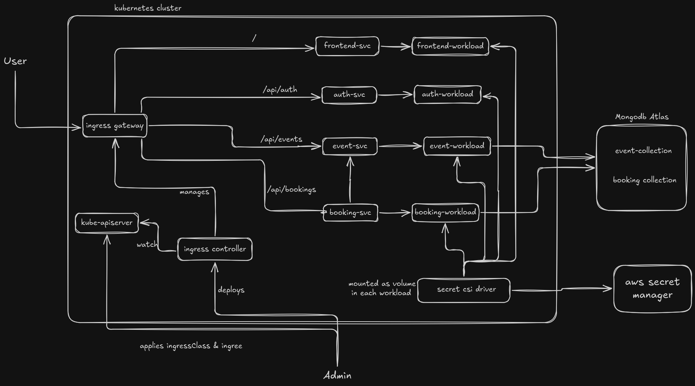
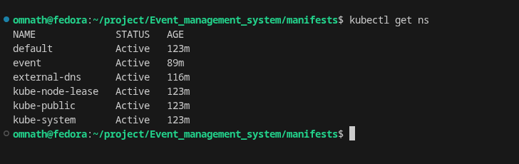

# 🎟️ Event Management System — Deployed on Amazon EKS (Kubernetes)

> A production-ready, cloud-native microservices application deployed on **AWS EKS (Elastic Kubernetes Service)**, featuring user authentication, event creation, and ticket booking — all orchestrated with Kubernetes.

---

## 📌 Table of Contents

- [Project Overview](#project-overview)
- [Architecture](#architecture)
- [Tech Stack](#tech-stack)
- [Microservices Breakdown](#microservices-breakdown)
- [Kubernetes Infrastructure](#kubernetes-infrastructure)
- [AWS Infrastructure](#aws-infrastructure)
- [Application Walkthrough](#application-walkthrough)
- [Docker Images](#docker-images)
- [How to Reproduce](#how-to-reproduce)

---

## Project Overview

This project is a full-stack **Event Booking System** built using a microservices architecture and deployed end-to-end on **Amazon EKS**. Users can register, browse events, book tickets, and manage their bookings — all through a React frontend that communicates with independently deployed backend services.

The goal was to demonstrate real-world Kubernetes skills: writing production manifests, configuring AWS Load Balancers, managing secrets/configmaps, and running a live, accessible application on cloud infrastructure.

---

## Architecture



All services run in the **`event`** Kubernetes namespace with 2 replicas each for high availability.

---

## Tech Stack

| Layer | Technology |
|---|---|
| Cloud Provider | AWS (EKS, EC2, ALB, VPC) |
| Container Orchestration | Kubernetes 1.35 on EKS |
| Ingress Controller | AWS Load Balancer Controller |
| DNS / Routing | AWS Application Load Balancer |
| Node Type | EC2 t3.medium (3 nodes) |
| Infrastructure as Code | eksctl + CloudFormation |
| Container Registry | Docker Hub |
| Services | Node.js microservices + React frontend |

---

## Microservices Breakdown

The application is split into **4 independently deployable microservices**:

| Service | Docker Image | Port | Responsibility |
|---|---|---|---|
| Auth Service | `om6214/auth-svc` | 3001 | User registration, login, JWT tokens |
| Event Service | `om6214/event-svc` | 3002 | Create, list, and manage events |
| Booking Service | `om6214/booking-svc` | 3003 | Book tickets, cancel, view bookings |
| Frontend | `om6214/front-svc` | 80 | React SPA — UI for all user interactions |

Each service has its own:
- **Kubernetes Deployment** (2 replicas)
- **ClusterIP Service** for internal cluster communication
- **Secret** for sensitive environment variables (DB credentials, JWT secret)
- **ConfigMap** for non-sensitive configuration

---

## Kubernetes Infrastructure

### Namespaces

The cluster runs 6 namespaces. All application workloads are isolated in the `event` namespace:

](<event_proj_ss/Screenshot From 2026-03-28 15-09-38.png>)

### Cluster Info

The EKS cluster control plane runs on AWS managed infrastructure. The AWS Load Balancer Controller (2/2 replicas) is deployed in `kube-system` to manage ingress resources:

](<event_proj_ss/Screenshot From 2026-03-28 15-10-35.png>)

### Secrets & ConfigMaps

Sensitive data (DB passwords, JWT secrets) are stored as **Kubernetes Secrets**, and service configuration is managed via **ConfigMaps**:

](<event_proj_ss/Screenshot From 2026-03-28 15-11-00.png>)
](<event_proj_ss/Screenshot From 2026-03-28 15-11-00.png>)

**Secrets created:**
- `app-secret` — shared app-level secrets
- `auth-secret` — auth service credentials
- `booking-secret` — booking service credentials
- `event-secret` — event service credentials

**ConfigMaps created:**
- `auth-config`, `booking-config`, `event-config` — per-service config (6 keys each)
- `frontend-config` — frontend environment config (15 keys including API base URLs)

### Services, Deployments & Pods

All 4 deployments running with **2/2 replicas** (fully available), and all 8 pods in **Running** state:

](<event_proj_ss/Screenshot From 2026-03-28 15-12-27.png>)

**Services:**
- `auth-svc` → ClusterIP:3001
- `event-svc` → ClusterIP:3002
- `booking-svc` → ClusterIP:3003
- `frontend-service` → ClusterIP:80

### Ingress (AWS ALB)

The ingress routes external traffic via an AWS Application Load Balancer based on URL paths:

](<event_proj_ss/Screenshot From 2026-03-28 15-13-59.png>)

| Path | Backend Service |
|---|---|
| `/api/auth` | auth-svc:3001 |
| `/api/events` | event-svc:3002 |
| `/api/bookings` | booking-svc:3003 |
| `/` | frontend-service:80 |

> **Note:** The ingress initially showed `FailedDeployModel` warnings because HTTPS requires an ACM certificate. The application is currently running on HTTP (port 80) which works successfully. Adding an ACM certificate and enabling HTTPS would be the next production step.

---

## AWS Infrastructure

### EKS Cluster

The EKS cluster (`demo-eks`) runs Kubernetes 1.35, is Active, and was provisioned using `eksctl` which automatically created the underlying CloudFormation stacks:

](<event_proj_ss/Screenshot From 2026-03-28 15-21-06.png>)

### EC2 Worker Nodes

3 x `t3.medium` EC2 instances serve as Kubernetes worker nodes, distributed across availability zones for resilience:

](<event_proj_ss/Screenshot From 2026-03-28 15-22-31.png>)

| Instance | AZ | Public IP |
|---|---|---|
| demo-eks-node-1 | us-east-1a | 35.173.128.5 |
| demo-eks-node-2 | us-east-1a | 98.84.157.146 |
| demo-eks-node-3 | us-east-1b | 54.198.87.211 |

### Application Load Balancer

The AWS ALB (`k8s-event-eventman-ce5d84f351`) is **Active**, internet-facing, spans **6 Availability Zones**, and serves as the single entry point to the cluster:

](<event_proj_ss/Screenshot From 2026-03-28 15-22-16.png>)

**ALB DNS:** `k8s-event-eventman-ce5d84f351-126258529.us-east-1.elb.amazonaws.com`

### CloudFormation Stacks

`eksctl` provisioned the cluster through 2 CloudFormation stacks:

](<event_proj_ss/Screenshot From 2026-03-28 15-21-35.png>)

- `eks-cluster-stack` — EKS cluster + node group (NodeAutoScalingGroup, NodeInstanceRole, NodeSecurityGroup)
- `eksctl-demo-eks-addon-iamserviceaccount-...` — IAM role for the AWS Load Balancer Controller (IRSA)

### Security Groups

](<event_proj_ss/Screenshot From 2026-03-28 15-22-02.png>)

The node security group has inbound rules allowing:
- Port range 1025–65535 (Kubernetes worker communication)
- Port range 30000–32768 (NodePort range)
- Port 80–3003 (from ALB target group)
- All traffic within the cluster (node-to-node)
- HTTPS 443 (for pods running external-facing services)

---

## Application Walkthrough

### 1. Landing Page

The application is publicly accessible via the ALB DNS. The homepage offers event discovery, easy booking, and event creation:

](<event_proj_ss/Screenshot From 2026-03-28 15-14-59.png>)

### 2. Event Listing

After logging in, users can browse available events with search and sort functionality:

](<event_proj_ss/Screenshot From 2026-03-28 15-16-28.png>)

### 3. Event Details & Booking

Each event shows full details — date, location, available spots, price, tags — and a booking widget that calculates total cost dynamically:

](<event_proj_ss/Screenshot From 2026-03-28 15-19-30.png>)
](<event_proj_ss/Screenshot From 2026-03-28 15-16-51.png>)

### 4. My Bookings

After confirming a booking, users are redirected to "My Bookings" where they can see a booking reference number, ticket count, and cancellation option:


### 5. Create Event

Authenticated users can also create events by filling in title, description, location, date/time, max attendees, price, and tags:


---

## Docker Images

All services are containerized and pushed to Docker Hub:

| Service | Image |
|---|---|
| Auth Service | `om6214/auth-svc` |
| Booking Service | `om6214/booking-svc` |
| Event Service | `om6214/event-svc` |
| Frontend | `om6214/front-svc` |

---

## How to Reproduce

### Prerequisites
- AWS CLI configured
- `eksctl` installed
- `kubectl` installed
- Docker Hub account

### 1. Provision EKS Cluster

```bash
eksctl create cluster \
  --name demo-eks \
  --region us-east-1 \
  --nodegroup-name demo-node \
  --node-type t3.medium \
  --nodes 3 \
  --managed
```

### 2. Install AWS Load Balancer Controller

```bash
# Associate OIDC provider
eksctl utils associate-iam-oidc-provider --cluster demo-eks --approve

# Create IAM service account for ALB controller
eksctl create iamserviceaccount \
  --cluster=demo-eks \
  --namespace=kube-system \
  --name=aws-load-balancer-controller \
  --attach-policy-arn=arn:aws:iam::<ACCOUNT_ID>:policy/AWSLoadBalancerControllerIAMPolicy \
  --approve

# Install via Helm
helm install aws-load-balancer-controller eks/aws-load-balancer-controller \
  -n kube-system \
  --set clusterName=demo-eks \
  --set serviceAccountName=aws-load-balancer-controller
```

### 3. Apply Kubernetes Manifests

```bash
# Create namespace
kubectl create namespace event

# Apply secrets and configmaps
kubectl apply -f secrets/ -n event
kubectl apply -f configmaps/ -n event

# Deploy services
kubectl apply -f deployments/ -n event
kubectl apply -f services/ -n event

# Apply ingress
kubectl apply -f ingress.yaml -n event
```

### 4. Verify

```bash
kubectl get pods -n event          # All pods Running
kubectl get svc -n event           # All services ClusterIP
kubectl get ingress -n event       # ALB address provisioned
```

### 5. Access the App

```
http://<ALB-DNS-from-kubectl-get-ingress>
```

---

## Key Kubernetes Concepts Demonstrated

- **Multi-namespace isolation** — application workloads separated from system components
- **Secrets management** — sensitive data stored as opaque Kubernetes secrets, not in code
- **ConfigMaps** — environment configuration decoupled from container images
- **Deployments with replicas** — 2 replicas per service for zero-downtime updates
- **ClusterIP Services** — internal service discovery between microservices
- **Ingress with path-based routing** — single ALB entry point routing to 4 different backends
- **IRSA (IAM Roles for Service Accounts)** — secure AWS permissions for the ALB controller without node-level IAM access
- **Health checks** — ALB health checks on `/` to verify pod readiness

---

## 📄 License

MIT — feel free to fork, adapt, and deploy.